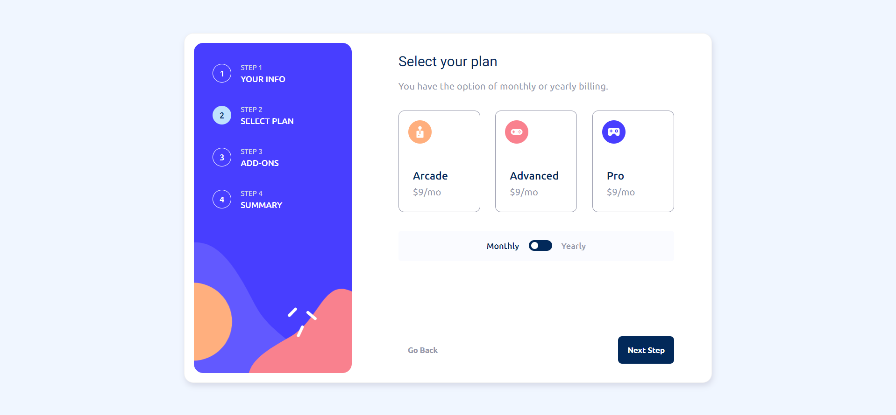

# Frontend Mentor - Multi-step form solution

This is a solution to the [Multi-step form challenge on Frontend Mentor](https://www.frontendmentor.io/challenges/multistep-form-YVAnSdqQBJ). Frontend Mentor challenges help you improve your coding skills by building realistic projects.

## Table of contents

- [Overview](#overview)
  - [The challenge](#the-challenge)
  - [Screenshot](#screenshot)
  - [Links](#links)
- [My process](#my-process)
  - [Built with](#built-with)
  - [What I learned](#what-i-learned)
  - [Continued development](#continued-development)
- [Author](#author)

## Overview

### The challenge

Users should be able to:

- View the optimal layout for the site depending on their device's screen size
- See hover states for all interactive elements on the page
- Open a lightbox gallery by clicking on the large product image
- Switch the large product image by clicking on the small thumbnail images
- Add items to the cart
- View the cart and remove items from it

### Screenshot

### Links

- Solution URL: [Add solution URL here](https://github.com/KarimAyman97/MultiStepForm)

## My process

### Built with

- Semantic HTML5 markup
- CSS custom properties
- Flexbox
- [Angular](https://angular.io/) - Angular framework

### What I learned

I learned alot doing this challenge, Its my first time to make step-form without using angular stepper

To see how you can add code snippets, see below:

### Continued development

i want to keep focusing on using my css skills .

## Author

- Website - [Karim Ayman](https://karimayman97.github.io/ECommerceProductPage/ECommerceProductPage/)
- Frontend Mentor - [@KarimAyman97](https://www.frontendmentor.io/profile/KarimAyman97)
- Linkedin - [@yourusername](https://www.linkedin.com/in/karimayman97/)
